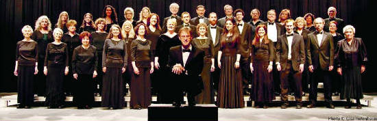
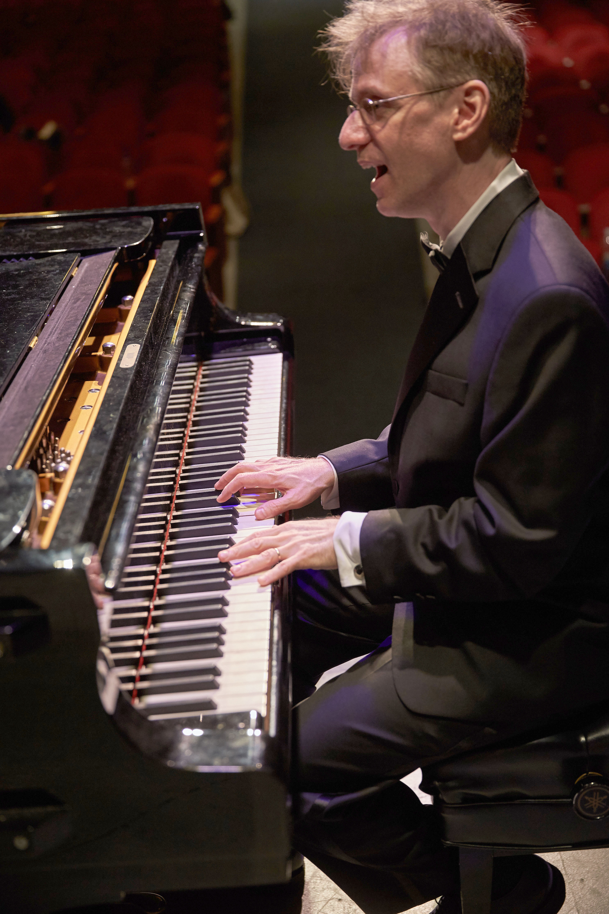

# The Yiddish Philharmonic Chorus

{: .rounded .mx-auto .d-block }

We sing with the Chorus to nourish our souls and to share our love for Yiddish choral music. Our varied and growing repertoire is mainly in four-part harmony and exclusively in the Yiddish language, some with lyrics by honored poets. We interpret works from the Eastern European shtetl as well as newer songs with a contemporary sound—preserving tradition while keeping a modern audience in mind. 

The Chorus began as a musical expression of the Jewish labor movement. It was founded in 1922 as the *Freiheit Gezang Farein,* an outgrowth of the leftist *Morgen Freiheit* Yiddish newspaper. In 1948, the Chorus changed its name to The Jewish People’s Philharmonic Chorus—likely to avoid scrutiny during the McCarthy era. Now that we’re a century old, we’ve changed the name again—to reflect our goals of learning, enjoying, and promoting the Yiddish language and Yiddish choral music. 

For more details on the Chorus’s history, [click here](milestones.html).

# Our Conductor

{: .rounded .mx-auto .d-block height="350px" }

**Binyumen Schaechter** has conducted the Chorus since 1995. In addition to leading the ensemble, he creates contemporary arrangements for much of our repertoire. He’s transformed classics like [*“Dayenu”*](https://www.youtube.com/watch?v=p3R98uechsQ) and adapted current tunes like The *Godfather* theme into modern Yiddish choral works. He promotes Yiddish language and culture by teaching singers to correctly pronounce and interpret lyrics and to understand the history of each song they perform.

Aside from his leading role in the Yiddish music world, Binyumen (known as Ben in non-Yiddish circles) is an award-winning composer of musicals, revue songs, and cabaret songs. Off-Broadway shows featuring his music include *Naked Boys Singing* (the fourth-longest-running show in off-Broadway history), *Pets!* (about people and their relationship with their pets), *That’s Life!* (nominated for an Outer Critics Circle Award), and *Too Jewish?* (nominated for the Drama Desk and Outer Critics Circle Awards). His music for *Double Identity* was praised by The New York Times for its “ear-catching score.” *It Helps To Sing About It,* a revue of songs he composed with lyricist Dan Kael, won the 2018 ASCAP-Bistro Award for Outstanding Musical Revue. Ben and Dan’s [“I Can Tell Time”](https://www.youtube.com/watch?v=SE0EiVH0bDc) earned them the 2018 MAC Award for Best Song, and [“Apply”](https://www.youtube.com/watch?v=e2v3rM8xYx4) made them finalists for Best Comedy Song. These two numbers and others from the show are on YouTube.

As a translator of arias and songs into Yiddish (his native tongue), Binyumen has crafted singable Yiddish translations of many songs,
including [“Anything You Can Do,”](https://www.youtube.com/watch?v=QWhEgXAQIGU) [“Auld Lang Syne,”](https://www.youtube.com/watch?v=l7DAqgjlm2I) [“Baby, It’s Cold Outside,”](https://www.youtube.com/watch?v=_zQxlFVP2oE) [“Over the Rainbow,”](https://www.youtube.com/watch?v=mG9B971NSC8) the “Habañera” from Carmen, and Puccini’s *“O, Mio Babbino Caro.”*

Binyumen often presents at conferences and festivals on topics relating to Yiddish music and the Yiddish language. Three popular topics are “Ashkenazic Family Names: What Our Names Mean About Our Families,” “How to Sing in Yiddish So That It Sounds Like Yiddish,” and, from an autobiographical perspective, “How It Came to Be, in 21st Century America, That Our Entire Extended Family Speaks Yiddish.” On his own, he has also toured with “The Yiddish Top Chai – A Sing-Along Countdown of the 18 Yiddish Songs People Most Love to Sing.”

He toured for many years with both of his Yiddish-speaking actor-singer daughters, [*Di Shekhter-tekhter*](http://yiddishsisters.com/) performing in Australia, Brazil, Europe, Israel, and North America, and played a central role in their 2012 documentary film, [*When Our Bubbas and Zeydas Were Young: The Schaechter Sisters on Stage*](https://jewishvideo.com/shop/ols/products/when-our-bubbas-and-zeydas-were-young). He was also musical director of the Pripetshik Singers, the one-of-a-kind ensemble of native-Yiddish-speaking children, documented in the film [*Pripetshik Sings Yiddish!*](https://jewishvideo.com/shop/ols/products/pripetshik-sings-yiddish).

Binyumen and his three sisters were raised in a Yiddish-speaking home by the linguist Dr. Mordkhe Schaechter and Charne Schaechter, *z”l.* The four siblings all speak Yiddish with their own offspring—a combined total of sixteen children and twenty-one grandchildren.

Contact Binyumen at [info@YiddishChorus.org](mailto:info@yiddishchorus.org).

# Our concerts

We provide our concert audiences with printed song translations and, when possible, supertitles. Thanks to these aids and to the Chorus’s expressive presentation, even the Yiddish-challenged can understand and appreciate our songs.  

At our spring and fall concerts, audience members receive a special keepsake Journal. The 40-page booklet contains the full concert program, transliterated lyrics and translations, bios of the singers, and ads placed by individuals, businesses, and organizations to honor a Chorus member, memorialize a loved one, or promote a business or organization. To place an ad in a future Journal, contact us at [info@YiddishChorus.org](mailto:info@yiddishchorus.org).  

We’ve performed for diverse audiences in the greater New York area, bringing Yiddish music to people of all ages in various settings—Lincoln Center, Shea Stadium, Congregation Kehilath Jeshurun (NYC), the World Trade Center site after 9/11, the Museum of the City of New York, the North American Jewish Choral Festival, Queens College (CUNY), Riverside Church (NYC), Symphony Space, and West Point Military Academy. Since 2015, we have been holding our spring gala concert and our fall encore concert at Merkin Concert Hall.  

We also post excerpts of our concerts on YouTube. To be notified of future concerts and new YouTube postings, ask us to include your email address in our distribution list. Contact us at [info@YiddishChorus.org](mailto:info@yiddishchorus.org).

The Chorus’s 2006 CD, *Zingt! A Celebration of Yiddish Choral Music,* continues a tradition of recording Yiddish music that began in 1948. Generous donations to the Chorus by individuals and foundations provided the impetus for this project. The CD includes *“Reb Dovidl,” “Shoyshanas Yaakoyv,” “Vaserl,”* and other Yiddish hits.

# Our workshops

During the COVID-19 pandemic, Binyumen Schaechter developed the Yiddish Song Workshop & Sing-Along (YSWS) through Zoom and YouTube to keep the chorus involved in learning and singing while they couldn’t meet in person. The series has been open to Yiddish-music-lovers everywhere.  Nearly 700 people from around the world have registered for these song events.  

                   The next workshops on four Sunday evenings will feature Yiddish Chanukah songs:  

                               October 31, November 07, November 14, and November 28  
                                              7 to 8 p.m. Eastern Time  
                                              
                Click [here] (https://us02web.zoom.us/meeting/register/tZYvc-qgpjMoGddICPc2_TjhCiqjTXYdyCjN) to register in advance

During the first three sessions, we’ll learn to sing a baker’s dozen of Yiddish Chanukah songs – the lyrics and translations are displayed on the screen.  We’ll also learn some linguistic, musical, and historical background for each song.  In the last session, on the first evening of Chanukah, we’ll have a sing-through of all the Yiddish Chanukah songs we learned.  And, together over Zoom around the world, we’ll sing the blessings and light the first Chanukah candle.  

The YSWS is free and open to everyone.  As a donation premium, participants receive video links for each session and a Chanukah song booklet with transliterated lyrics and translations.  Contact us at [info@YiddishChorus.org](mailto:info@yiddishchorus.org) to be notified of future YSWS series.  
