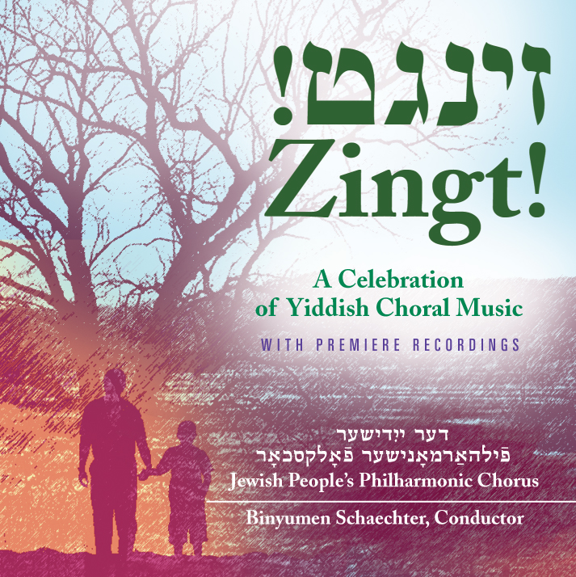

# YouTube Channel

<iframe src="https://www.youtube.com/embed/?listType=playlist&list=PLWDQKhjcVIxRtz6puEFJ3nscAggDp04Nu" frameborder="0" allow="accelerometer; autoplay; encrypted-media; gyroscope; picture-in-picture" allowfullscreen class="video"></iframe>

[Click here](https://www.youtube.com/channel/UCbCGJxhJOEDDlHxZqhp4cgQ) to see all of our videos on YouTube.

Be sure to [follow us on Facebook](https://www.facebook.com/thejppc/)!

# CD

{: .rounded .mx-auto .d-block }

Released in 2006, this CD was a long time coming. Several albums had been recorded by the JPPC through 1967, but none after then. This CD showcases the range of musical styles, moods and themes in our repertoire. We hope this selection of choral gems in "Zingt!" - most of which have not been recorded in a choral version before - will delight and inspire you as it has our audiences since its release.

Yiddish, Latin transcription, and full English translation is included with each CD.  
[Click to hear a sample!](attachments/vaserl_clip.mp3)

[Click here for a list of songs and artists](zingt.html)

**To order a CD, or to make a contribution to the JPPC, please complete the attached form and mail it to us, with your check, at the address on the form:**  
[*Make a donation / Order a CD*](attachments/cdorderflyerfinal_14.pdf)

[The CD is now also available for purchase on Amazon!](http://www.amazon.com/Zingt-Celebration-Yiddish-Choral-Music/dp/B0015I2X4M/ref=sr_1_1?ie=UTF8&qid=1404178145&sr=8-1&keywords=zingt)
