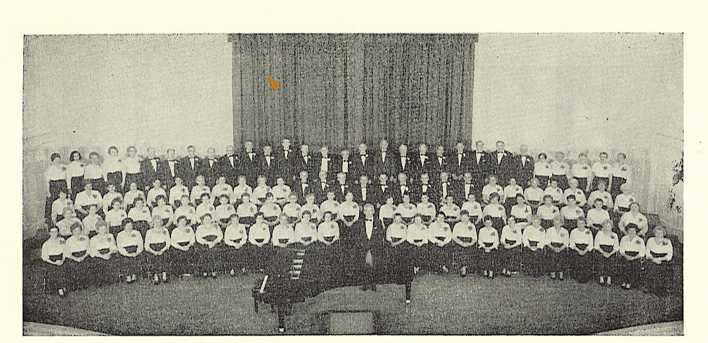

# JPPC Milestones 1922-2013

The JPPC, 1923

**1922** - The *Freiheit Gezang Farein* (FGF) is founded by conductor/composer Lazar Weiner on New York's Lower East Side  
**1923** - Sat., Feb. 23, Carnegie Hall - FGF gives its first concert, including a song that was to be a staple of its repertoire for some 20 years: *"Di Internatsionale"*  
**1925** - The Jewish Workers Music Alliance *(Der yidish-muzikalisher arbeter-farband)* is founded as funding organization for many Yiddish choruses. During its 60-year existence, the Alliance publishes 7-8 collections of Yiddish choral works and solo works (first under the title *"Mit gezang tsum kamf",* then *"Gezang un kamf"*), edited by FGF conductors Jacob Schaefer and Max Helfman  
**1926** - Feb. 20, Mecca Temple, NYC - The FGF, conducted by Weiner, debuts Jacob Schaefer's oratorio, Tsvey Brider, the first time a Yiddish chorus performed with an orchestra  
**1926-36** - Jacob Schaefer conducts the FGF, at its height a 300-singer chorus  
**1920s** - Choruses of the International Workers Order / IWO *("ordn-khorn")* spring up all over the city (Washington Heights, Brighton, Brownsville, Coney Island, Kings Highway, Jamaica, two in the Bronx, the "Downtown" and the "Yugnt" branch), the tri-state area (Newark, Passaic, Paterson, Farmer's Chorus and Connecticut) and the country (Boston, Chicago, Cleveland, Detroit, Miami, Philadelphia, Washington DC, Bay Area, Los Angeles, Petaluma). There were 30 in all, nationwide  
**1932** - "*Mit gezang tsum kamf* - Songs for Voice and Piano" published by the International Workers Order, compiled and arranged by Jacob Schaefer  
**1934** - *"Gezang un kamf",* the 2nd in the series, now with a new name, and now published by *Der yidisher muzikalisher arbeter-farband* / IMAF (106 E 14 St, NYC), complied and edited by Jacob Schaefer  
**1935-40** - *"Gezang un kamf",* issues 3 through 8, are published, one each year, edited by Schaefer through 1936, Helfman from 1938-1940, and a combination of the two for the issue that was published in 1937  
**1936** - Schaefer passes away suddenly at age forty-eight  
**1936-48** - Max Helfman conducts the FGF  
**1937** - The Jewish Workers Music Alliance changes its name to the Jewish Music Alliance *(Der yidisher muzik-farband)*  
**1938** - Freiheit newspaper editor Moyshe Olgin passes away. A force in the creation and continuation of the FGF, Olgin is memorialized by the song *"Mir zogn tsu"* (words: Yuri Suhl; music: Max Helfman), which becomes a staple of the FGF's repertoire  
**1948** - The FGF changes its name to the Jewish People's Philharmonic Chorus  
**1948** - Sun. eve, June 13, Carnegie Hall - Max Helfman's final concert with the JPPC and premiere of Helfman's "Di Naye Hagode", his haunting setting of Itsik Fefer's epic poem, *"Di shotns fun varshever geto"* (Shadows of the Warsaw Ghetto)  
**1948-52** - Dr Leon Kopf, German refugee, conducts the JPPC. The earliest Chorus recording dates from this period  
**1952-60** - Eugene (Yehuda) Malek conducts the JPPC  
**1953** - The first annual concert of the Jewish Cultural Clubs and Societies features the sister chorus of the JPPC, the Jewish People's Chorus of New York (JPCNY) conducted by Maurice Rauch, performing the first of many dramatic chorales written by Itche Goldberg in collaboration with Rauch as composer

The JPPC, 1964

**1958/59** - The JPCNY makes two recordings: A Goldfaden Collection, and the folk-operetta adapted from Sholom Aleichem stories, Sholem Aleichem Dir, Amerike!  (libretto: Martin Birnbaum, music: Maurice Rauch)  
**1960-71** - The JPCNY merges into the JPPC and Maurice Rauch becomes conductor of the "new" chorus. During Rauch's tenure, the JPPC records Schaefer's *Tsvey Brider* (1967), the last recording of the Chorus, until 2006  
**1971-72** - Oscar Julius conducts the JPPC  
**1972-78** - Maurice Rauch returns to conduct the JPPC  
**1978-80** - Franco Rossi conducts the JPPC  
**1980** - Rauch conducts one concert for the JPPC  
**1980-84** - Madeline Simon is the JPPC’s first female conductor  
**1984-95** - Peter Schlosser conducts the JPPC  
**1985** - The Jewish Music Alliance merges into the Zhitlowsky Foundation  
**1995** - Binyumen Schaechter takes over as conductor of the JPPC  
**1998** - JPPC begins year-round Outreach Concerts throughout NYC tri-state area, from Town Hall to the Museum of Jewish Heritage. The JPPC becomes arguably the first Yiddish chorus ever to sing a cappella and selectively mixed (not in vocal sections)  
**2000, 2001, 2003** - The JPPC is one of only two Yiddish choruses to perform at the North American Jewish Choral Festival at the Nevele Hotel, Ellenville, NY  
**2000** - The JPPC becomes the first Yiddish chorus to perform on the World Trade Center Plaza  
**2001** - The JPPC sings for a Chanuka Memorial Ceremony at Ground Zero, site of the World Trade Center terrorist attacks  
**2002, 2005, 2006** - The JPPC is the only Jewish chorus to perform at the New York International Choral Festival at Alice Tully Hall (Lincoln Center)  
**2003** - The Jewish People’s Philharmonic Chorus celebrates 80 years of preserving, creating, and sharing Yiddish song, becoming the world’s longest continually operating Jewish chorus  
**2005** - The JPPC is the first Yiddish chorus to perform at Shea Stadium (Queens, NY), singing our National Anthem at the NY Mets' Jewish Heritage Day, as well as Mark Zuckerman's choral arrangement of "America the Beautiful" in Yiddish ("Amerike di prekhtike")  
**2006** - The JPPC releases its first CD, the Chorus' first recording in 39 years  
**2007** - The JPPC records its first live-in-concert DVD, which was then released in 2009  
**2007** - The JPPC for the first time is filmed and recorded for a feature film, "Tickling Leo", released in 2009  
**2007, 2010, 2011, 2013** - The JPPC is the only Yiddish chorus to perform at the North American Jewish Choral Festival at the Hudson Valley Resort & Spa, Kerhonkson, NY  
**2008** - The JPPC performs its annual gala spring concert for the first time at Symphony Space  
**2010** - The JPPC performs for the first time in Riverside Church, as the only Jewish chorus in the 5th New York International Choral Festival  
**2011** - The JPPC becomes the first Yiddish chorus ever to perform standing entirely mixed  
**2013** - The JPPC is invited to perform (and performs) at the Cathedral of St. John the Divine, the 4th largest church in the world  
